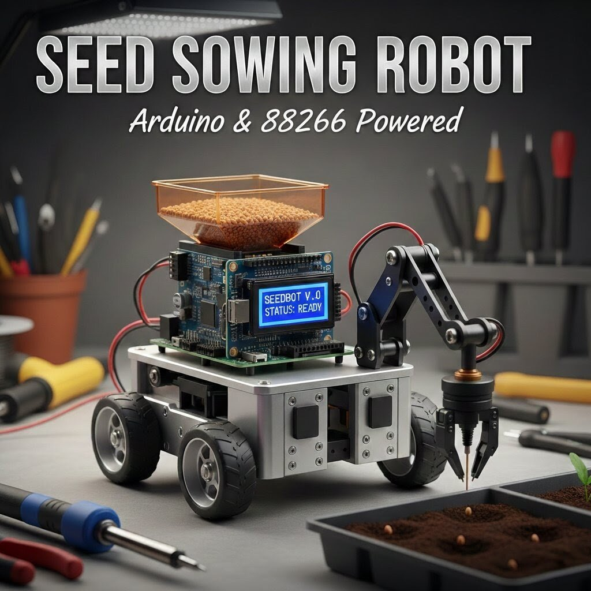

# 🌱 ESP32 Seed Sowing Robot 🌱

A WiFi-controlled agricultural robot built using ESP32 that allows users to remotely control movement and toggle seed sowing through a built-in browser portal.

# Overview

The ESP32 Seed Sowing Robot is a smart farming prototype designed to automate the process of planting seeds. The robot creates its own WiFi network (SSID). When a user connects to this network and opens the device IP address in a browser, a control portal appears.

From the portal, the user can move the robot in different directions and enable or disable seed sowing. A servo mechanism opens or closes a seed dispensing flap to release seeds into the soil while the robot moves.

# Features

- ESP32 based control system
- Built-in WiFi portal
- Browser-based robot control
- Forward, backward, left, and right movement
- Servo-controlled seed dispensing flap
- Toggle seed sowing ON or OFF
- Compact smart agriculture prototype

# Hardware Components

- ESP32 Development Board
- L298N Motor Driver
- DC Gear Motors
- Robot Chassis
- Servo Motor
- Seed Container with Flap Mechanism
- Battery Pack
- Jumper Wires

  

  

# Software Technologies

- Arduino IDE
- ESP32 WiFi Library
- Embedded C++
- Web-based control interface

# Working Principle

1. The ESP32 creates its own WiFi hotspot.
2. The user connects to the robot’s SSID using a mobile phone or laptop.
3. The user opens the ESP32 IP address in a web browser.
4. A control portal appears with movement buttons.
5. The robot can be driven forward, backward, left, or right.
6. A button on the portal toggles seed sowing ON or OFF.
7. When enabled, a servo motor opens the seed flap to release seeds.

# Applications

- Smart farming automation
- Agricultural robotics research
- Precision seed planting experiments
- Educational robotics projects

# Future Improvements

- Automatic row detection
- GPS-based field navigation
- Adjustable seed spacing
- Soil moisture based planting
- Solar powered farming robot

## Project Difficulty: Intermediate Embedded System (Tough if u messed!)

## Development Time: 1 Week

# Author

Embedded Systems Project by Jash.
